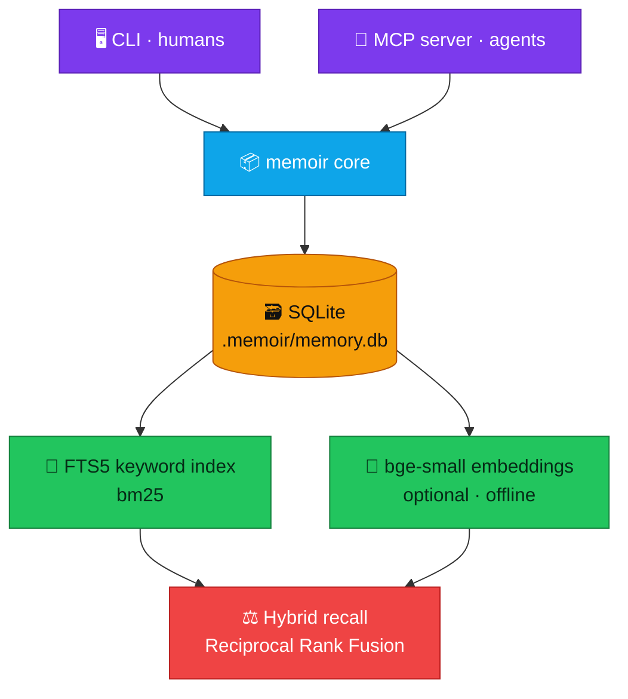

<div align="center">

# 🧠 memoir

### Your codebase finally remembers.

**Long-term memory for your repo — an embedded house memory, not a pile of `.md` files.**

The *why*, the *don't*, the *not-yet*, and the *how-we-like-it* — captured once, recalled forever, by every session that ever opens this repo.

<br>

[](https://nodejs.org)
[](#license)
[](#how-its-built-the-honest-architecture)
[](#-it-works-on-a-plane-it-works-air-gapped-it-just-works)
[](#for-your-ai-agent-mcp)
[](#contributing)
[](#how-its-built-the-honest-architecture)

<br>

**[⚡ Plug it in](#-plug-it-in)** · **[✨ Features](#-what-it-feels-like)** · **[🤖 For agents](#for-your-ai-agent-mcp)** · **[🏗️ Architecture](#how-its-built-the-honest-architecture)** · **[🤝 Contributing](#contributing)**

</div>

---

## 🗂️ The old way: your context rots in `.md` files

You know the drill. `CLAUDE.md`, `NOTES.md`, `ARCHITECTURE.md`, `DECISIONS.md` — a growing graveyard of markdown you started with good intentions. Here's how that holds up:

<div align="center">

| | 🗂️&nbsp; **A pile of `.md` files** | 🧠&nbsp; **memoir** |
|---|---|---|
| **Staying current** | ❌ rots silently — contradictions pile up | ✅ new facts cleanly **supersede** old ones |
| **Using it** | ❌ paste the whole file, or `grep` and pray | ✅ just **ask in plain language** |
| **Relevance** | ❌ flat — the line you need is buried on line 400 | ✅ ranked by **keyword *and* meaning** |
| **Context-aware** | ❌ blind to where you are in the code | ✅ **anchored** — surfaces on the right file |
| **Who maintains it** | ❌ you, by hand, forever | ✅ your **agent, automatically** |
| **Built for** | ❌ humans reading top-to-bottom | ✅ machines retrieving by relevance |

</div>

Meanwhile the *expensive* context — why you chose SQLite over Postgres, why that function is fragile, that the user likes tabs and hates being sold to — either rots in those files or evaporates when the session closes. Tomorrow you retype the same paragraph. So does your teammate. So does the next agent.

---

## ✨ What memoir does

memoir replaces the pile with **one queryable memory that lives in your repo.**

Instead of documents you babysit, you capture **atomic facts** — each tagged by kind (decision, gotcha, convention…) and anchored to the code it's about. You get them back by **asking in plain language**, ranked by **keyword *and* meaning.** New facts **supersede** old ones, so it never rots into contradictions. And your AI agent pulls from it **automatically** — recalling the right context before it acts. No copy-paste. No stale dump.

> Code is the *what.* Git is the *when / who.* **memoir is the *why*, the *don't*, the *not-yet*, and the *how-we-like-it*** — captured once, recalled forever, by every session that ever opens this repo.

---

## ⚡ Plug it in

> [!NOTE]
> **Prerequisite (once):**
> ```bash
> npm install     # Node ≥ 24 — ships SQLite, runs TypeScript natively, no build step
> ```
> Semantic search is an optional bonus: a tiny local model auto-installs on first use, and if it can't, memoir simply falls back to keyword recall.

Now pick how you want it wired in 👇

### Option 1: MCP server (recommended)

> [!IMPORTANT]
> **This is the magic path.** Register memoir with your agent and it calls memory *on its own* — recalling before it acts, remembering as it works. **You just do normal work.**

**🟣 Claude Code — one command:**

```bash
# from the repo root
claude mcp add memoir -- node "$(pwd)/src/mcp.ts"

# share it with your whole team (writes .mcp.json into the repo, travels with git):
claude mcp add memoir --scope project -- node "$(pwd)/src/mcp.ts"
```

**🔵 Any other MCP client — drop this in the config:**

```jsonc
{
  "mcpServers": {
    "memoir": { "command": "node", "args": ["/absolute/path/to/memoir/src/mcp.ts"] }
  }
}
```

That's it. [You won't lift a finger during a session →](#do-i-need-to-do-anything-during-a-session-no)

### Option 2: CLI (you drive)

Prefer to drive yourself, scripting, or working without an agent? Use the command line directly — same memory, same store:

```bash
node src/cli.ts remember "Store is embedded SQLite, no server to run" --type decision --anchors src/store.ts
node src/cli.ts recall "why isn't this postgres"
```

> [!TIP]
> Most people set up **Option 1** and reach for the CLI occasionally. Both write to the exact same `.memoir/memory.db` — pick either, or use both.

---

## 🌟 What it feels like

> [!IMPORTANT]
> **About the examples below.** They show the `memoir …` CLI so you can see *exactly* what's happening. **With the MCP server (Option 1) you type none of it — and you don't even ask.** The agent recalls and remembers *reflexively, on its own,* while you work. No `memoir`, no "remember this," no managing anything. (You *can* nudge it — *"remember that we chose SQLite because…"* — but you rarely need to.)

<br>

### 🧠 You explain something once. Forever.

```bash
memoir remember "We chose embedded SQLite over Postgres — no server to run, \
  and the Mem0 data shows a graph DB actually *hurts* our query types" \
  --type decision --anchors src/store.ts --tags storage
```

Six months from now, a teammate — or an AI agent that has never seen this repo — asks "why isn't this Postgres?" and the answer is *right there*, in your words, with the reasoning intact.

> ✨ **The feeling —** the relief of never re-litigating a settled decision. Your past self does the explaining, so your future self doesn't have to.

<details><summary>🔬 <b>Peek under the hood</b></summary>

<br>

Each memory is one atomic fact stored as a row in an embedded SQLite database (`node:sqlite`, in core — no native deps). Writes are auto-embedded and indexed for keyword search in a single atomic transaction. Memories are natural language, not rigid fields — the Mem0 research showed dense prose beats structured graph representations for most query types.
</details>

---

### 🔎 Ask in plain English. Get the right answer.

```bash
memoir recall "where are we on the parser"
```

You don't need to remember the exact words you used. memoir runs **hybrid recall** — keyword *and* meaning — so "where are we on the parser" surfaces the note you filed as "recursive descent strategy, WIP." It reads your intent, not your phrasing.

> ✨ **The feeling —** like asking a colleague who's been here the whole time, and actually getting the answer instead of a shrug.

<details><summary>🔬 <b>Peek under the hood</b></summary>

<br>

Recall fuses two rankings with **Reciprocal Rank Fusion**: SQLite **FTS5** bm25 keyword search, and brute-force cosine similarity over local **bge-small-en-v1.5** embeddings (384-dim, mean-pooled, L2-normalized — so cosine reduces to a dot product). Both votes count, so exact-term hits and semantic neighbors both surface. Brute force is sub-millisecond at a repo's memory scale; an ANN index is deferred until a store would ever pass tens of thousands of memories.
</details>

---

### 📌 Memory that knows *where* it lives.

```bash
memoir remember "Don't await inside this loop — it serializes the batch" \
  --type gotcha --anchors src/embed.ts
```

A memory isn't just text in a drawer — it's *anchored* to the files, modules, and symbols it's about. So the warning about `src/embed.ts` can surface the moment an agent opens `src/embed.ts`, **before** it touches the landmine.

> ✨ **The feeling —** the right caution arriving the exact moment you'd otherwise step on the rake. The one thing a folder of `.md` files fundamentally cannot do.

<details><summary>🔬 <b>Peek under the hood</b></summary>

<br>

`anchors` pin a memory to code locations (files / modules / symbols / concepts), stored as JSON and indexed alongside content and tags. This enables context-driven recall: surface a memory because of *where you are*, not just *what you typed*.
</details>

---

### ♻️ Memory that stays honest.

```bash
memoir remember "Config is now injected, not a global singleton" \
  --type decision --supersedes a1b2c3d4
```

Decisions change. Instead of letting old notes rot into contradictions, memoir lets a new fact **supersede** an old one — the outdated memory steps aside, the truth stays current. No graveyard of stale advice quietly leading people astray.

> ✨ **The feeling —** trust. When memoir tells you something, it's telling you what's true *now* — not what was true three pivots ago.

<details><summary>🔬 <b>Peek under the hood</b></summary>

<br>

Reconciliation (ADD / UPDATE / DELETE / NOOP) is borrowed from Mem0's update phase, done explicitly by the agent — no separate LLM pipeline. Supersession flips the old row to `superseded` and links it to its replacement, all inside one transaction with the new write. IDs resolve by the short 8-char prefix the CLI displays, so you can act on what you see.
</details>

---

### 🔒 It works on a plane. It works air-gapped. It just works.

No API keys. No network calls. No account. Every write and every recall completes fully offline — the embedding model runs locally, and if it can't load, memoir gracefully drops to keyword-only recall instead of failing.

> ✨ **The feeling —** memory you actually own. A file in your repo, not a row in someone else's database — and nothing you remember ever leaves your machine.

<details><summary>🔬 <b>Peek under the hood</b></summary>

<br>

Hard constraint: **no memory write or recall may require a network call.** The local model (transformers.js) is an *optional* dependency loaded by dynamic import; absent or unreachable, `available()` returns false and recall degrades to keyword-only. The embedding model name is recorded per-vector, so different models are never compared and switching means a one-time re-embed (`memoir reembed`).
</details>

---

### 🗃️ One file. Committed. Travels with the repo.

memoir's entire memory is a single SQLite file in `.memoir/`. Commit it, and your team's collective context ships with `git clone`. Whoever opens the repo next — human or agent — inherits everything the repo has ever learned about itself.

> ✨ **The feeling —** onboarding that takes minutes instead of weeks. The repo explains itself.

<details><summary>🔬 <b>Peek under the hood</b></summary>

<br>

`.memoir/memory.db` is intentionally **not** gitignored — its design memory travels with the repo. (The transient WAL sidecars `*.db-wal` / `*.db-shm` *are* ignored.) Concurrent writers — a long-lived MCP server and the CLI — are handled with WAL mode plus a `busy_timeout`, so they wait politely instead of erroring.
</details>

---

## 🏷️ Seven kinds of memory

memoir stores only what you **cannot** reconstruct from the repo:

<div align="center">


</div>

| | type | what it captures |
|---|------|------------------|
| 🧭 | `decision` | why X over Y, including the alternatives you rejected |
| 📐 | `convention` | the implicit rules that keep things consistent |
| ⚠️ | `gotcha` | landmines, fragile code, the "don't" |
| 🚧 | `constraint` | hard boundaries that shape everything |
| 📖 | `glossary` | what a domain term actually means *here* |
| 🔄 | `state` | what's in-flight right now, the intentional WIP |
| 🎚️ | `preference` | how this particular person likes to work |

---

## For your AI agent (MCP)

memoir speaks the **Model Context Protocol**, so any MCP-aware agent gets reflexive memory: it recalls relevant context *before* acting, and remembers durable facts *as it works* — no prompting required. (Setup is one command up in [Plug it in → Option 1](#option-1-mcp-server-recommended).)

Exposed tools: `recall` · `remember` · `list` · `forget`. The server ships usage instructions so agents know to lean on it without being told.

> ✨ **The feeling —** an agent that gets *better the longer it lives in your codebase*, instead of one with amnesia every morning.

### Do I need to do *anything* during a session? **No.**

Once the MCP server is registered, memory is **automatic and reflexive.** You don't type `memoir`, you don't go fishing for old notes, and you rarely decide what's worth keeping. The agent does all of it on its own as it works:

- 🔮 **Recalls before it acts** — walking into your repo already knowing the *why*, the *don't*, and the *not-yet*, without a reminder.
- ✍️ **Remembers as it goes** — when a real decision is made or a landmine is found, it files the fact (right type, right code anchors) in the background.
- 🧹 **Keeps memory honest** — when something changes, it supersedes the stale note instead of letting it rot.

You just do normal work. The memory takes care of itself — with one exception worth knowing about: an [open-ended discussion that never lands on a decision](#when-should-you-say-remember-this) can slip past the agent's instinct to save. When that's something you care about, *"remember this"* pins it.

> [!TIP]
> **TL;DR** — In an agent session: **do nothing, it just happens.** At a terminal on your own: use the CLI. Same memory, either way.

### When *should* you say "remember this"?

Here's the honest mechanic, so you know where the edges are. memoir **does not transcribe your session.** A fact becomes a memory only when the agent *decides* it's durable and calls `remember` — it's a **judgment call, not an automatic recorder.** Nothing is saved just because it was discussed, and nothing is saved just because code was written. The save is its own deliberate act.

That instinct fires reliably on **outcomes**:

- ✅ a **decision** gets made — and *why*, including the option you rejected
- ✅ a **landmine** is found
- ✅ a **rule, boundary, or preference** is stated
- ✅ a **chunk of work** is finished or paused

But it has one blind spot: **open-ended exploration.** A topic you talked through that never hardened into a decision can slip past — it reads as "thinking out loud," so the trigger never fires. You discussed it; nobody saved it; it's gone.

The fix is one sentence — **just say "remember this":**

> *"Remember that ANN discussion."*
> *"Don't lose the reasoning on why we deferred X."*
> *"Save that for later."*

Any of those is enough. You **don't** specify a type, anchors, or tags — the agent shapes the memory for you. This bypasses the agent's judgment entirely, so reach for it whenever something matters to you but didn't end in a clean *"we decided."* It's the safety net under the automatic capture.

> ✨ **The feeling —** you stay in flow, and on the rare thing the agent wouldn't think to keep, three words pin it forever.

---

## 🖥️ CLI reference

The **manual door** — for working at a terminal yourself. In an agent session you usually won't need this; [just talk to the agent](#do-i-need-to-do-anything-during-a-session-no) instead.

```bash
memoir init                     # create .memoir/ here — claim this folder as a memory root
memoir remember <content…> --type <type> [--anchors a,b] [--tags x,y] [--supersedes id,id]
memoir recall   <query…>   [--type <type>] [--limit N]
memoir list                [--type <type>] [--limit N]
memoir forget   <id>            # full id or the short prefix shown in output
memoir reembed                  # backfill embeddings for memories created without them
memoir types                    # list the seven memory types
memoir where                    # path to this repo's memory + how many it holds
```

---

## How it's built (the honest architecture)

A deliberately small seed, built to **earn** complexity rather than assume it:



**📦 Dependency map** — the core CLI/library is **zero runtime dependencies.** The MCP entrypoint adds `@modelcontextprotocol/sdk` + `zod`. Embeddings add `transformers.js` (optional). TypeScript runs directly on Node 24 via type-stripping — **there is no build step.**

**🧭 Deferred on purpose** — a graph layer (edges are just a table away with recursive-CTE traversal, earned only when temporal/relational queries prove they need it) and an ANN index (only past ~50k memories). *Vector-first, graph-ready.*

---

## Contributing

```bash
npm test     # 42 tests · built-in node:test runner · no framework dependency
```

memoir is **built by dogfooding memoir** — every design decision in this repo was recorded into memoir itself and recalled before the next step. The `.memoir/` you cloned *is* that history; `memoir recall "architecture"` is a live tour of how it was built and why.

**Ground rules the codebase holds itself to:**

- ✅ **Zero `unknown` types, zero blind casts** in `src/` — DB values are validated at the boundary on read.
- ✅ **No build step** — Node runs the TypeScript directly (strip-only mode: no parameter properties, no emitting enums, etc.).
- ✅ **Keep the core zero-dependency** — new runtime deps go behind optional/dynamic imports, never in the hot path.
- ✅ **Tests use `node:test` only** — don't add a test framework.

---

## License

MIT.

<div align="center">
<br>

### Stop re-explaining your codebase.
### Tell it once. Let it remember. 🧠

<br>

<sub>Built by dogfooding itself.</sub>

</div>
